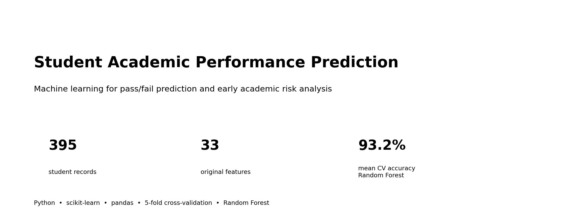
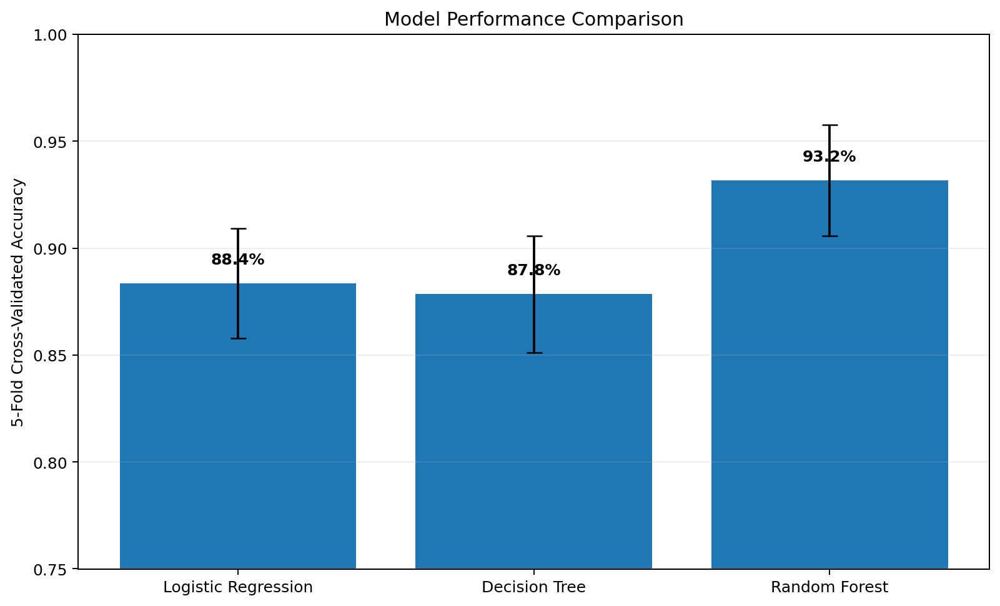
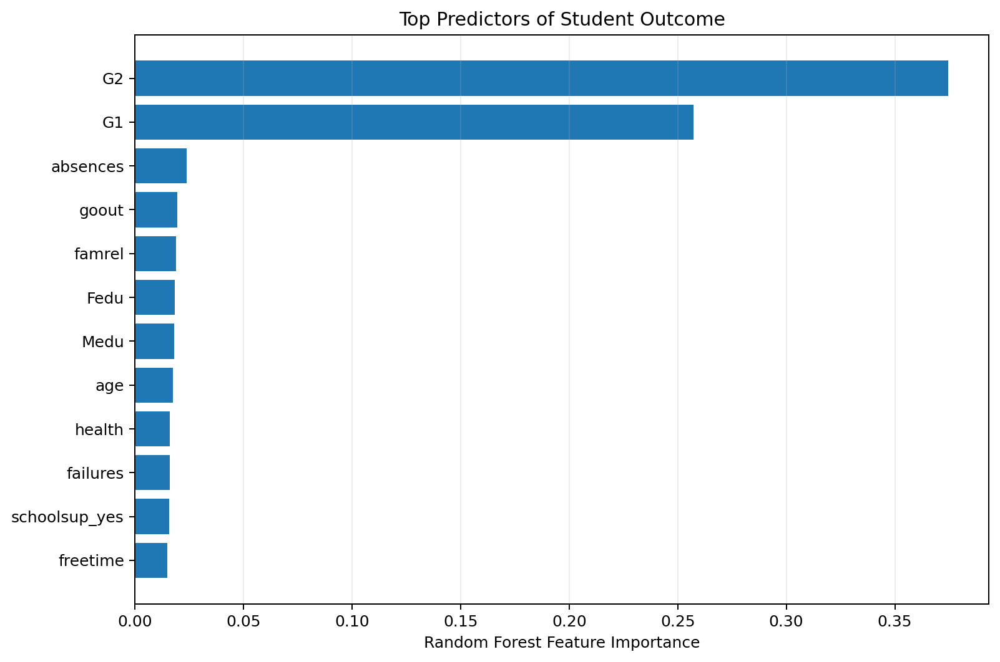
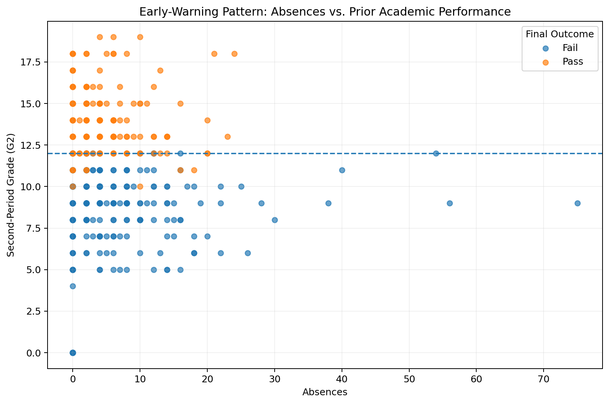
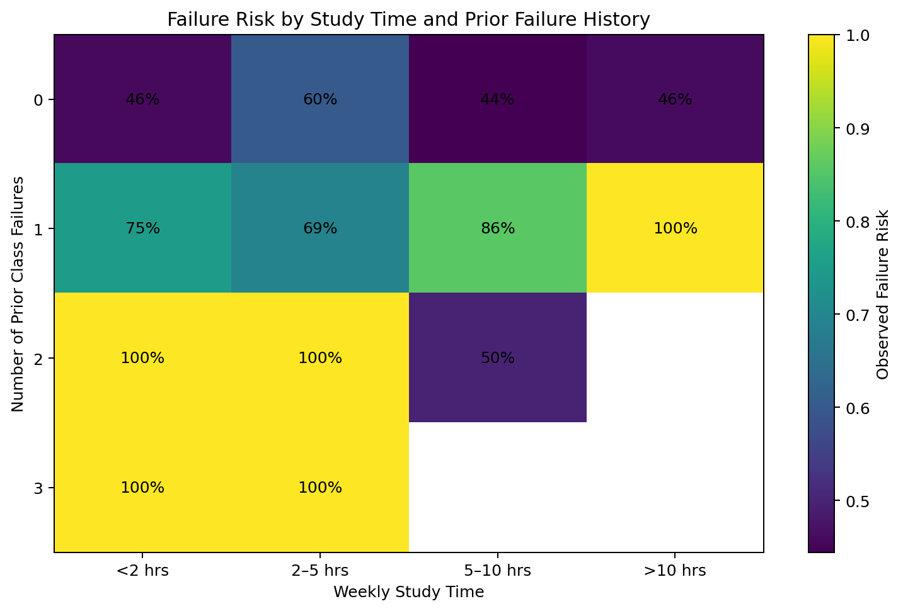

<p align="center">
  
</p>

# Student Academic Performance Prediction Using Machine Learning

A machine learning project that predicts whether a student will **pass or fail** and explores academic and behavioral patterns that may help identify students who need additional support. The project compares multiple classification models and uses 5-fold cross-validation for evaluation.

## Project Highlights

- **Dataset:** 395 student records with 33 original demographic, academic, family, and behavioral variables.
- **Target:** Final grade (`G3`) converted to a binary outcome: **Pass = G3 ≥ 12**, otherwise **Fail**.
- **Best headline model:** Random Forest with **93.2% mean 5-fold cross-validated accuracy**.
- **Strongest predictors:** Prior academic performance (`G2`, `G1`) dominates the Random Forest feature-importance ranking; absences and several contextual variables contribute additional signal.
- **Decision-support angle:** The analysis also explores study time, prior failures, absences, and model outputs as potential early-warning indicators.

## Model Performance

<p align="center">
  
</p>

| Model | Mean Accuracy | Std. Dev. |
|---|---:|---:|
| Logistic Regression | 88.4% | 2.6% |
| Decision Tree | 87.8% | 2.7% |
| **Random Forest** | **93.2%** | **2.6%** |

The Random Forest achieved the strongest performance among the three headline models while remaining relatively stable across folds. The notebook also experiments with KNN, Perceptron, SVC, Gaussian Naive Bayes, MLP, Agglomerative Clustering, and K-Means.

## What Drives the Prediction?

<p align="center">
  
</p>

The model places the greatest importance on **G2** and **G1**, which represent earlier grading periods. This is useful for predicting the final result, but it also means the project should be interpreted as an **academic-risk prediction study**, not as proof that the model can detect risk at the very beginning of a semester.

## Early-Warning Patterns

<p align="center">
  
</p>

Students with lower prior grades are much more likely to fall into the final fail group. Absences provide additional context, especially when interpreted together with prior academic performance.

<p align="center">
  
</p>

Prior failure history is an important risk signal. The grouped analysis suggests that greater study time can be associated with lower observed risk, but it does not erase the elevated risk associated with previous failures.

## Workflow

`Data collection → data quality checks → target engineering → one-hot encoding → model training → 5-fold cross-validation → model comparison → risk-pattern analysis`

### Preprocessing

- Checked data types, missing values, and outliers.
- Retained statistically unusual observations because they can represent real student behavior rather than data-entry errors.
- Converted categorical variables with one-hot encoding.
- Standardized inputs for scale-sensitive models such as Logistic Regression, KNN, SVC, Perceptron, and MLP.
- Used the same 5-fold evaluation structure to compare headline models.

## Repository Structure

```text
Student-Academic-Performance-Prediction/
├── assets/                         # README visualizations
├── data/
│   └── student_data.csv
├── notebooks/
│   └── student_performance_prediction.ipynb
├── presentation/
│   └── project_presentation.pptx
├── reports/
│   └── project_report.pdf
├── .gitignore
├── README.md
└── requirements.txt
```

## Run the Project

```bash
git clone <your-repository-url>
cd Student-Academic-Performance-Prediction
python -m venv .venv
```

Activate the environment, then install dependencies:

```bash
pip install -r requirements.txt
jupyter notebook
```

Open `notebooks/student_performance_prediction.ipynb` and run the cells from top to bottom. The GitHub-ready notebook has been adjusted to load the dataset using repository-relative paths rather than a Google Colab upload step.

## Dataset

This project uses the **Student Performance Dataset**, a dataset based on the work of Cortez & Silva (2008) and distributed through Kaggle. It contains records from Portuguese secondary-school students and includes demographic, family, lifestyle, and academic variables.

**Reference:** Cortez, P., & Silva, A. (2008). *Using Data Mining to Predict Secondary School Student Performance.* Proceedings of the 5th Future Business Technology Conference (FUBUTEC 2008).

> Before publishing the dataset itself, confirm that the Kaggle dataset's redistribution terms allow you to include the CSV directly in your repository. If not, remove `data/student_data.csv` and provide download instructions instead.

## Limitations

- The dataset is small (395 rows) and comes from a limited student population, so results should not be assumed to generalize to other institutions.
- The pass/fail classes are not perfectly balanced.
- Strong reliance on `G1` and `G2` means the best-performing model uses prior grade information that may only become available after the semester has begun.
- The analysis is predictive and correlational; feature importance does **not** establish causation.
- The original notebook's model-confidence visualization is based on predictions from a Random Forest fitted on the full dataset. It is useful descriptively, but it should not be presented as an out-of-sample reliability estimate.

## Future Improvements

- Use **StratifiedKFold** for classification-focused cross-validation.
- Add nested cross-validation or a separate test set for hyperparameter tuning and final evaluation.
- Compare an **early-semester model that excludes G1/G2** with the full-feature model to quantify the tradeoff between earlier intervention and predictive accuracy.
- Add calibration metrics/plots for trustworthy probability estimates.
- Evaluate fairness and performance across relevant student subgroups before any real decision-support use.
- Expand the dataset across schools and time periods and, eventually, connect predictions to a carefully designed educator-facing early-warning dashboard.

## Team

- Chukwunonyelum Rosalyn Ezeako
- Kavya Kalidindi
- Ruyi Gai

**Supervisor:** Dr. Yu Luo

---

*Academic machine learning project. Predictions from this repository are for educational analysis and should not be used as automated decisions about individual students.*
